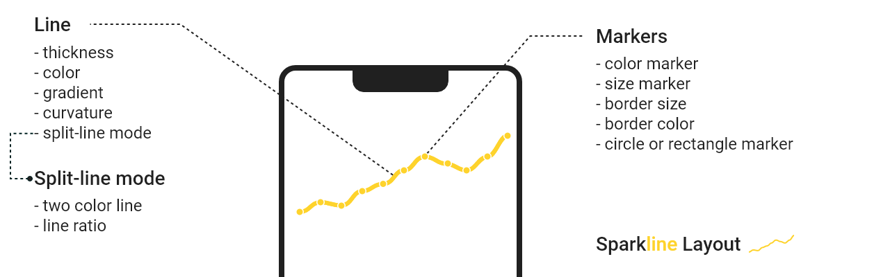

<p align="center">
    
</p>

[](https://www.android.com)
[](https://android-arsenal.com/details/1/7825)
[](https://jitpack.io/#majorkik/SparkLineLayout)
[](https://opensource.org/licenses/MIT)

# SparkLineLayout

## Usage

Add it in your root build.gradle at the end of repositories:
```groovy
allprojects {
    repositories {
        maven { url 'https://jitpack.io' }
    }
}
```
Add the dependency
```groovy
dependencies {
      implementation 'com.github.majorkik:SparkLineLayout:1.0.1'
}
```

Or Maven

```xml
<repositories>
    <repository>
        <id>jitpack.io</id>
        <url>https://jitpack.io</url>
    </repository>
</repositories>
````
```xml
<dependency>
    <groupId>com.github.majorkik</groupId>
    <artifactId>SparkLineLayout</artifactId>
    <version>1.0.1</version>
</dependency>   
```


## XML

```xml
<com.majorik.sparklinelibrary.SparkLineLayout
    android:layout_width="match_parent"
    android:layout_height="100dp"
    android:background="#212121"
    app:s_line_color="#fed32c"
    app:s_line_thickness="4dp"
    app:s_marker_background_color="#fed32c"
    app:s_marker_is_circle_style="true"
    app:s_marker_width="8dp" />
```

## XML Attributes
<p align="center">
    <br>
</p>


XML attributes | Description
--------|----------
s_line_color | Sets the line color
s_line_second_color | Sets the secondary color of the line. Necessary for the gradient when **s_gradient_line="true"**
s_line_thickness | Sets the line thickness
s_line_bezier | Responsible for the curvature of the line. **0.5** is recommended for the curve, and *0* for straight lines.
s_gradient_line | Enables or disables the gradient for the line.
s_split_line | Enables or disables split line mode. When **false**, the parameters: **s_split_ratio**, **s_split_left_color** and **s_split_right_color** are ignored.
s_split_ratio | Ratio of line sizes (**from 0 to 1**)
s_split_left_color | Sets the color for the left line when **s_split_line="true"**
s_split_right_color |Sets the color for the right line when **s_split_line="true"**
s_marker_width | Sets the width of the marker. When **s_marker_circle_style="true"**, it is responsible for the radius of the marker.
s_marker_height | Responsible for the height of the marker. When **s_marker_circle_style="true"** ignored.
s_marker_background_color | Sets the color of the marker.
s_marker_border_color | Sets the color of the stroke.
s_marker_border_size | Sets the stroke thickness.
s_marker_circle_style | Switches marker mode to round. The default **false**, and the marker is square.

## Examples 


# License

<b>SparkLineLayout</b> is licensed under `MIT license`. View [license](LICENSE.md).